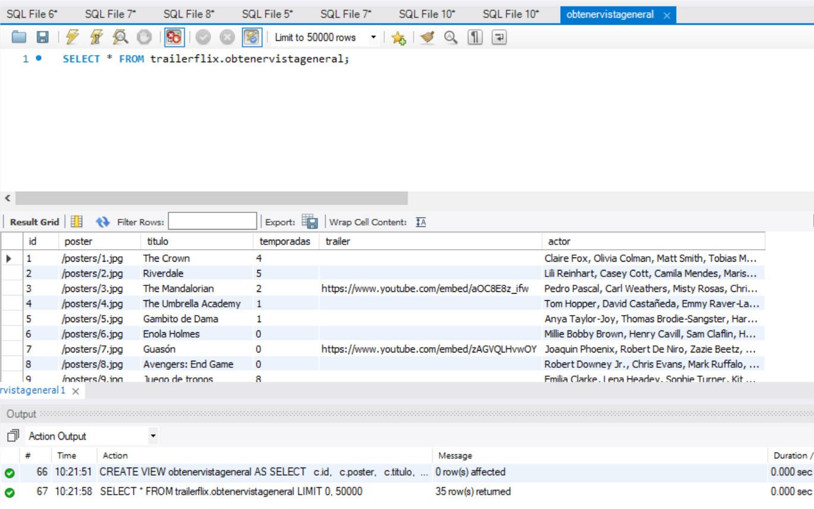

## Proyecto integrador 3 NODE.JS, MySQL Workbench, SEQUELIZE

Esta es una API construida con Express.js y MySQL usando Sequelize. Proporciona puntos finales para gestionar actores, géneros, contenido y categorías.

###  Requisitos previos

* Node.js
* MySQL
* Sequelize

### Installation

1. Clonar repositorio..
2. Install las dependencias  `npm install`.
3. Crear un archivo `.env` y agregar las siguientes variables de entorno:

Utiliza el código con precaución. Más información
DATABASE_HOST=localhost
DATABASE_PORT=3306
DATABASE_USERNAME=root
DATABASE_PASSWORD=password
DATABASE_NAME=my_database

4. Inicie el servidor MySQL con `npm start`.
5. Cree la base de datos con `mysql -u root -p < ./config/db.sql`.
6. Inicie el servidor Express.js con `node server.js`.

### Endpoints

**GET /**

Devuelve un mensaje de bienvenida.

**GET /actores/:id**

Devuelve el actor con el ID especificado.

**GET /actores**

Devuelve una lista de todos los actores.

**GET /contenido/:id**

Devuelve el contenido con el ID especificado.

**GET /contenido**

Devuelve una lista de todo el contenido.

**GET /contenido/titulo/:titulo**

Devuelve el contenido con el título especificado.

**GET /categoria**

Devuelve una lista de todas las categorías.

**GET /genero/:nombre**

Devuelve el género con el nombre especificado.

**GET /genero/categoria/:categoryID**

Devuelve los géneros en la categoría especificada.

**GET /obtenervistageneral**

Devuelve una descripción general de la base de datos.

### Uso de ejemplo

Para obtener una lista de todos los actores, enviar una solicitud GET al siguiente punto final:

http://localhost:3000/actores

Esto devolverá una respuesta JSON con una lista de todos los actores, incluido su ID, nombre y otros detalles.

Para obtener el actor con el ID 1, puede enviar una solicitud GET al siguiente punto final:

http://localhost:3000/actores/1

Esto devolverá una respuesta JSON con los detalles del actor.

Para crear un nuevo actor, puede enviar una solicitud POST al punto final /actores con los detalles del actor en el cuerpo de la solicitud.

Para actualizar un actor existente, puede enviar una solicitud PUT al punto final /actores/:id con los detalles actualizados del actor en el cuerpo de la solicitud.
To delete an actor, you can send a DELETE request to the /actores/:id endpoint.

Puede utilizar los otros puntos finales de forma similar.

Manejo de errores
Si se produce un error, la API devolverá una respuesta JSON con la siguiente estructura:

json
{
"error": "Mensaje de error",
"description": "Descripción detallada del error"
}

El mensaje de error será una breve descripción del error y la descripción proporcionará información más detallada sobre el error.

### Ejemplo Vista general MySQL
.

### Diagrama MySQL Workbench

Conclusión
Esta es una API Express.js simple que se puede utilizar para administrar actores, géneros, contenido y categorías. Es fácil de usar y proporciona un buen punto de partida para crear API más complejas.

Esta documentación de Markdown se puede utilizar para generar una variedad de formatos de documentación, como HTML, PDF y EPUB. También se puede utilizar para generar documentación para otros lenguajes y marcos de programación.